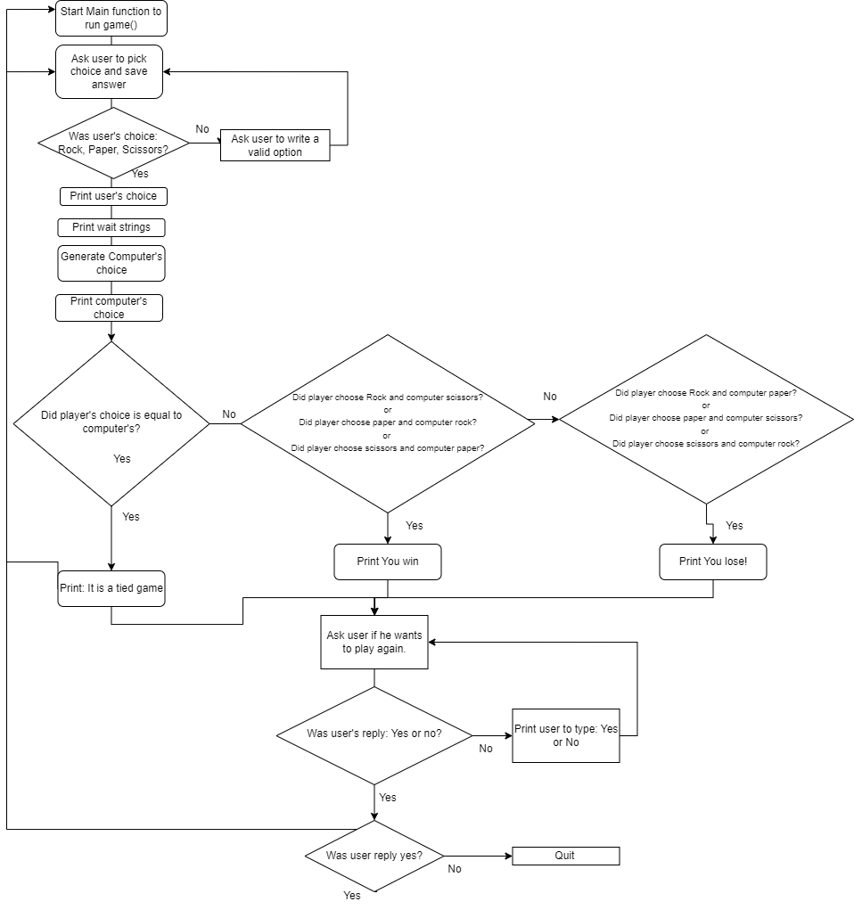

# OPS445 - Group Lab - Group 1

This is the submission for the OPS445 Group Lab for Group 1.

## Team Roles

Adam Mohy - Script Developer

Arshvir Uppal - QA Tester

Jordan Moore - Project Manager

Oscar Daniel Dominguez Reyes - QA Tester / Visual Designer

## Game Design

Our iteration of Rock, Paper, Scissors works by prompting the user to select either rock, paper or scissors and ensuring one of those options is chosen. After the user selects their choice, the script will run and choose which option the game will use. Based on the chosen options, the script will inform the user if they won or lost. It will then ask the user if they would like to play again by selecting yes or no, after which the script will loop or exit.

## Game Flowchart 

This is our flowchart of how the script functions, and the processes/decision making it will use while running.

## Iteration 1

After creating the first iteration of the script, we found several issues in our QA testing. These included:

- Shebang line was missing from script. 
- No error checking to ensure user picks either rock, paper or scissors, causing the game to not complete.
- Game would exit upon completion without a prompt to play again.

## Iteration 2

For the second iteration, we corrected the errors found above. During QA testing we found:

- Shebang line added.
- Added an error check to make sure the user inputs the correct choice at the beginning, and provided a message of options to choose from. 
- Game can now successfully complete and prompt user if they would like to play again. 

After this iteration, we deemed the game complete and pushed the iteration 2 branch to the main branch for release. 